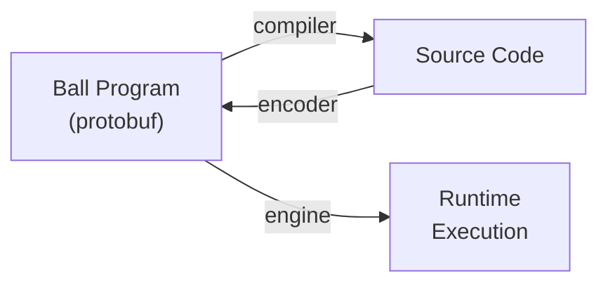
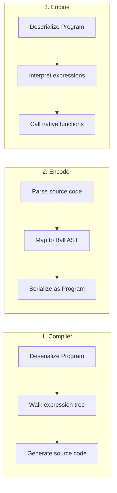

<p align="center">
  
</p>

<h1 align="center">Ball Programming Language</h1>

<p align="center">
  <strong>Code is Data</strong> — A programming language where every program is a Protocol Buffer message
</p>

<p align="center">
  <a href="https://ball-lang.dev">Website</a> •
  <a href="docs/">Documentation</a> •
  <a href="examples/">Examples</a> •
  <a href="LICENSE">MIT License</a>
</p>

---

**Ball** is a programming language represented entirely as [Protocol Buffer](https://protobuf.dev/) messages. Every program is a structured protobuf message that can be serialized, shared, inspected, and compiled to any target language.

## Why Ball?

| Problem | How Ball Solves It |
|---|---|
| **Code sharing** | Programs are protobuf messages — send code over the wire, store in databases, share between platforms |
| **Dynamic code generation** | Build and modify program ASTs at runtime using any language with protobuf support |
| **Interoperability** | Compile Ball to Dart, C++, and more target languages |
| **No syntax errors** | The protobuf schema enforces structural validity — if it deserializes, it's syntactically valid |
| **Introspection** | Programs are data structures — inspect, transform, and optimize code programmatically |
| **Language-agnostic types** | Uses protobuf's own descriptor types (`DescriptorProto`) — protobuf already defines type mappings for every target language |

## Core Concepts

### Everything is a Function Call

Every Ball function has a **single input message** and a **single output message** (like gRPC):

```
Function: print
  Input:  PrintInput { message: string }
  Output: (void)
  Base:   true  ← implementation provided by target language
```

### Base Functions

Base functions have **no body** — their implementation is provided by each target language's compiler/engine. This is the extensibility mechanism:

- `std` — arithmetic, comparisons, control flow, string ops, I/O
- `std_collections` — list and map operations
- `std_io` — console, process, time, random
- `std_memory` — linear memory (C/C++ interop)
- **Your own** — define any base module for your platform

### Control Flow as Functions

`if`, `while`, `for_each` are base functions, keeping the language uniform:

```json
{
  "call": {
    "module": "std",
    "function": "if",
    "input": {
      "messageCreation": {
        "fields": [
          { "name": "condition", "value": { "...": "bool expression" } },
          { "name": "then", "value": { "...": "then expression" } },
          { "name": "else", "value": { "...": "else expression" } }
        ]
      }
    }
  }
}
```

### Expression Tree

Every Ball computation is one of seven node types:

| Node | Purpose | Example |
|------|---------|---------|
| `call` | Call a function | `std.add(left, right)` |
| `literal` | Constant value | `42`, `"hello"`, `true` |
| `reference` | Variable access | `input`, `x` |
| `fieldAccess` | Field of a message | `input.name` |
| `messageCreation` | Construct message | `Point{x: 1, y: 2}` |
| `block` | Sequential statements | `let x = 1; let y = 2; x + y` |
| `lambda` | Anonymous function | `(input) => input.x + 1` |

## Hello World

**Ball program** (`examples/hello_world/hello_world.ball.json`):

```json
{
  "name": "hello_world",
  "entryModule": "main",
  "entryFunction": "main",
  "modules": [
    {
      "name": "std",
      "types": [{ "name": "PrintInput", "field": [{ "name": "message", "number": 1, "type": "TYPE_STRING" }] }],
      "functions": [{ "name": "print", "inputType": "PrintInput", "isBase": true }]
    },
    {
      "name": "main",
      "imports": ["std"],
      "functions": [{
        "name": "main",
        "body": {
          "call": {
            "module": "std", "function": "print",
            "input": { "messageCreation": { "typeName": "PrintInput", "fields": [
              { "name": "message", "value": { "literal": { "stringValue": "Hello, World!" } } }
            ]}}
          }
        }
      }]
    }
  ]
}
```

**Compiled Dart output:**

```dart
void main() {
  print('Hello, World!');
}
```

**Compiled C++ output:**

```cpp
#include <iostream>

int main() {
  std::cout << "Hello, World!" << std::endl;
  return 0;
}
```

## Language Support

For a language to **fully support** Ball, three programs are needed:

| Program | Direction | Purpose |
|---|---|---|
| **Compiler** | Ball → language | Generates target language source code |
| **Encoder** | Language → Ball | Converts source code into Ball programs |
| **Engine** | Ball → execution | Interprets Ball programs directly at runtime |



### Implementation Status

| Language | Compiler | Encoder | Engine | Tests |
|----------|----------|---------|--------|-------|
| **Dart** | ✅ Full | ✅ Full | ✅ Full | 242 engine tests |
| **C++** | ✅ Prototype | ✅ Prototype | ✅ Prototype | 37 compiler + engine tests |
| Go | Proto bindings | — | — | — |
| Python | Proto bindings | — | — | — |
| TypeScript | Proto bindings | — | — | — |
| Java | Proto bindings | — | — | — |
| C# | Proto bindings | — | — | — |

## Getting Started

### Prerequisites

- [Dart SDK](https://dart.dev/get-dart) ≥ 3.9
- [Buf CLI](https://buf.build/docs/installation) (optional — for regenerating protobuf bindings)

### Run a Ball program

```bash
cd dart && dart pub get

# Execute directly (engine)
cd engine && dart run bin/engine.dart ../../examples/hello_world/hello_world.ball.json

# Compile to Dart
cd compiler && dart run bin/compile.dart ../../examples/hello_world/hello_world.ball.json

# Run the engine tests
cd engine && dart test
```

### Encode Dart to Ball

```bash
cd dart/encoder
dart run bin/encode.dart path/to/file.dart
```

### Build C++ (prototype)

```bash
cd cpp
mkdir build && cd build
cmake ..
cmake --build .

# Proto linting/formatting via buf (requires buf CLI)
cmake --build . --target buf_lint
cmake --build . --target buf_format
cmake --build . --target buf_check   # lint + format
```

## Project Structure

```
ball/
├── proto/ball/v1/ball.proto          # Language schema (source of truth)
├── dart/                              # Dart implementation (most mature)
│   ├── shared/                        # Protobuf types, std module definitions
│   ├── compiler/                      # Ball → Dart code generator
│   ├── encoder/                       # Dart → Ball encoder
│   ├── engine/                        # Ball runtime interpreter (242 tests)
│   └── cli/                           # Command-line interface
├── cpp/                               # C++ implementation (prototype)
│   ├── shared/                        # Protobuf types
│   ├── compiler/                      # Ball → C++ code generator
│   ├── encoder/                       # C++ Clang AST → Ball encoder
│   └── engine/                        # Ball runtime interpreter
├── examples/                          # Example Ball programs (.ball.json)
├── tests/conformance/                 # Cross-implementation conformance tests
├── website/                           # ball-lang.dev (Jaspr static site)
├── docs/                              # Documentation
│   ├── IMPLEMENTING_A_COMPILER.md     # Guide for new target languages
│   ├── METADATA_SPEC.md              # Standard metadata keys
│   ├── GAP_ANALYSIS.md               # Coverage vs C++17 and Dart 3.x
│   ├── STD_COMPLETENESS.md           # Std library function matrix
│   └── ROADMAP.md                    # Development roadmap
└── {go,python,ts,java,csharp}/        # Proto bindings only
```

## Extending Ball

### Custom Base Modules

Define a platform-specific base module (e.g., Flutter):

```json
{
  "name": "flutter",
  "types": [
    { "name": "TextInput", "field": [
      { "name": "data", "number": 1, "type": "TYPE_STRING" },
      { "name": "fontSize", "number": 2, "type": "TYPE_DOUBLE" }
    ]}
  ],
  "functions": [
    { "name": "text", "inputType": "TextInput", "outputType": "Widget", "isBase": true }
  ]
}
```

Then implement the base function in your target compiler to generate the appropriate platform code.

### Adding a New Target Language

See [docs/IMPLEMENTING_A_COMPILER.md](docs/IMPLEMENTING_A_COMPILER.md) for a complete guide.



## Design Decisions

| Decision | Choice | Rationale |
|---|---|---|
| Serialization | proto3 | Better JSON mapping, simpler defaults |
| Tooling | [Buf](https://buf.build/) | Module management, linting, breaking change detection |
| Type system | `google.protobuf.DescriptorProto` | Language-agnostic — protobuf already maps types to every language |
| Control flow | Base functions | Uniform — everything is a function call |
| Function signature | Single input/output | gRPC pattern — simple, composable, serializable |
| Metadata | Cosmetic only | Stripping metadata never changes computation |

## Development

```bash
# Regenerate protobuf bindings
buf generate

# Lint the proto schema
buf lint

# Check for breaking changes
buf breaking --against ".git#subdir=proto"

# Run Dart engine tests
cd dart/engine && dart test

# Build C++
cd cpp/build && cmake .. && cmake --build .
```

## Contributing

Contributions are welcome! The biggest impact areas:

1. **Implement a new target language** — pick one from Go, Python, TypeScript, Java, C#, Rust
2. **Improve std library coverage** — see [docs/STD_COMPLETENESS.md](docs/STD_COMPLETENESS.md)
3. **Fix known issues** — see [docs/ROADMAP.md](docs/ROADMAP.md)

## License

[MIT](LICENSE)
