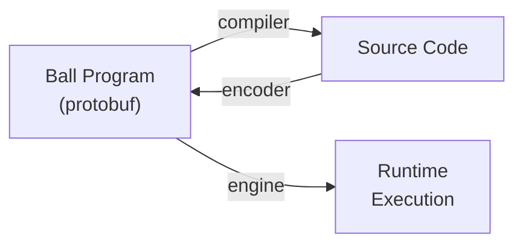

<p align="center">
  
</p>

<h1 align="center">Ball Programming Language</h1>

<p align="center">
  <strong>A polyglot programming language IR where every program is a Protocol Buffer message.</strong>
</p>

<p align="center">
  <a href="https://github.com/ball-lang/ball/actions/workflows/ci.yml"></a>
  <a href="https://www.npmjs.com/package/@ball-lang/engine"></a>
  <a href="LICENSE"></a>
  <a href="https://buf.build/ball-lang/ball"></a>
</p>

<p align="center">
  <a href="https://ball-lang.dev">Website</a> &middot;
  <a href="https://ball-lang.dev/playground">Playground</a> &middot;
  <a href="docs/">Documentation</a> &middot;
  <a href="examples/">Examples</a>
</p>

---

## Why Ball?

Programs are **structured data**, not text. A Ball program is a protobuf message that can be serialized, transmitted, stored in a database, and compiled to any target language — with zero parsing ambiguity.

| Capability | Details |
|---|---|
| **Programs are data** | Protobuf schema enforces structural validity. If it deserializes, it is syntactically valid. No parser, no syntax errors. |
| **Provably complete security auditing** | `ball audit` statically reports every side effect. No `eval`, no FFI, no hidden capabilities — every I/O operation flows through a named base function. |
| **Multi-language compilation** | Compile Ball to Dart, C++, and more. Encode Dart source back to Ball. Round-trip real-world code. |
| **Self-hosted toolchain** | The Dart reference interpreter (3000 LOC) is itself encoded as Ball, then compiled back to Dart with byte-identical conformance output. Also compiles to syntactically-valid TypeScript via ts-morph — 37/37 Dart fixtures round-trip to TS and execute byte-identical on Node. |
| **Three runtime engines** | Dart (true async), C++ (native), TypeScript (runs in the browser). |
| **Package management** | Import modules from pub, npm, and more registries with `ball add pub:package@^1.0.0`. |
| **Web playground** | Try Ball in your browser at [ball-lang.dev/playground](https://ball-lang.dev/playground). |

## Quick Start

### Install the TypeScript engine (runs anywhere)

```bash
npm install @ball-lang/engine
```

```typescript
import { BallEngine } from '@ball-lang/engine';

const program = JSON.parse(fs.readFileSync('hello_world.ball.json', 'utf-8'));
const engine = new BallEngine();
await engine.run(program);
```

### Or use the Dart CLI

```bash
cd dart && dart pub get

# Run a program
dart run ball_cli:ball run examples/hello_world/hello_world.ball.json

# Compile Ball to Dart source
dart run ball_cli:ball compile examples/hello_world/hello_world.ball.json

# Encode Dart source back to Ball
dart run ball_cli:ball encode my_app.dart

# Security audit
dart run ball_cli:ball audit examples/hello_world/hello_world.ball.json
```

## Hello World

**Ball program** (`hello_world.ball.json`):

```json
{
  "name": "hello_world",
  "entryModule": "main",
  "entryFunction": "main",
  "modules": [
    {
      "name": "std",
      "types": [{ "name": "PrintInput", "field": [{ "name": "message", "number": 1, "type": "TYPE_STRING" }] }],
      "functions": [{ "name": "print", "inputType": "PrintInput", "isBase": true }]
    },
    {
      "name": "main",
      "imports": ["std"],
      "functions": [{
        "name": "main",
        "body": {
          "call": {
            "module": "std", "function": "print",
            "input": { "messageCreation": { "typeName": "PrintInput", "fields": [
              { "name": "message", "value": { "literal": { "stringValue": "Hello, World!" } } }
            ]}}
          }
        }
      }]
    }
  ]
}
```

**Compiled Dart output:**

```dart
void main() {
  print('Hello, World!');
}
```

**Compiled C++ output:**

```cpp
#include <iostream>
int main() {
  std::cout << "Hello, World!" << std::endl;
  return 0;
}
```

## Architecture

### The 7 Expression Types

Every Ball computation is exactly one of these nodes:

| Node | Purpose | Example |
|---|---|---|
| `call` | Invoke a function | `std.add(left, right)` |
| `literal` | Constant value | `42`, `"hello"`, `true` |
| `reference` | Variable access | `input`, `x` |
| `fieldAccess` | Field of a message | `input.name` |
| `messageCreation` | Construct a message | `Point{x: 1, y: 2}` |
| `block` | Sequential statements | `let x = 1; x + 1` |
| `lambda` | Anonymous function | `(input) => input.x + 1` |

### Modules and Base Functions

Every function takes **one input message** and returns **one output message** (gRPC-style). Base functions have no body — their implementation is provided per-platform:

- **`std`** — ~73 functions: arithmetic, comparison, logic, bitwise, strings, math, control flow, type ops
- **`std_collections`** — ~43 functions: list/map operations
- **`std_io`** — ~10 functions: console, process, time, random
- **`std_memory`** — ~30 functions: linear memory for C/C++ interop
- **`dart_std`** — ~18 functions: Dart-specific (cascade, null-aware access, spread)

Control flow (`if`, `for`, `while`, `for_each`) is implemented as base function calls with lazy evaluation — keeping the language completely uniform.

### Schema

The single source of truth is [`proto/ball/v1/ball.proto`](proto/ball/v1/ball.proto). All implementations deserialize from this schema. Metadata fields are cosmetic — stripping all metadata never changes what a program computes.

## CLI Commands

| Command | Description |
|---|---|
| `ball run <program>` | Execute a Ball program |
| `ball compile <program>` | Compile to target language source code |
| `ball encode <source>` | Encode source code into a Ball program |
| `ball round-trip <source>` | Encode then compile, show diff |
| `ball audit <program>` | Static capability analysis (security) |
| `ball info <program>` | Inspect program structure |
| `ball validate <program>` | Check program validity |
| `ball build <program>` | Resolve imports into self-contained program |
| `ball init` | Create `ball.yaml` in current directory |
| `ball add <spec>` | Add dependency (`pub:pkg@^1.0.0`) |
| `ball resolve` | Resolve dependencies into `ball.lock.json` |
| `ball tree` | Print dependency tree |

## Ecosystem

### Implementation Status

| Language | Proto Bindings | Compiler | Encoder | Engine |
|---|---|---|---|---|
| **Dart** | Yes | Full | Full | Full (true async) |
| **C++** | Yes | Prototype | Prototype | Prototype |
| **TypeScript** | Yes | -- | -- | Full (browser + Node) |
| **Go** | Yes | -- | -- | -- |
| **Python** | Yes | -- | -- | -- |
| **Java** | Yes | -- | -- | -- |
| **C#** | Yes | -- | -- | -- |



### Extending Ball

Define custom base modules for any platform (Flutter, Unity, embedded):

```json
{
  "name": "flutter",
  "functions": [
    { "name": "text", "inputType": "TextInput", "outputType": "Widget", "isBase": true }
  ]
}
```

Then implement the base function in your target compiler or engine. See [docs/IMPLEMENTING_A_COMPILER.md](docs/IMPLEMENTING_A_COMPILER.md) for a complete guide.

## Security Model

Ball programs have **provably complete** capability analysis because:

1. **No `eval`** — programs are data, not text. There is no way to construct and execute arbitrary code at runtime.
2. **No FFI** — the only way to perform side effects is through base function calls with known names.
3. **Static analysis is exhaustive** — `ball audit` walks the expression tree and reports every base function call, categorized by capability (I/O, network, filesystem, process, memory).

The [`ball-audit` GitHub Action](.github/actions/ball-audit/action.yml) runs automatically on PRs that modify `.ball.json` files, blocking merges that introduce unauthorized capabilities.

## Contributing

### Build Commands

```bash
# Dart
cd dart && dart pub get
cd dart/engine && dart test
cd dart/encoder && dart test

# C++
cd cpp && mkdir -p build && cd build && cmake .. && cmake --build .

# TypeScript
cd ts/engine && npm install && npm test

# Proto (regenerate all bindings)
buf lint && buf generate
```

### Workflow

1. Schema changes: edit `proto/ball/v1/ball.proto` then `buf lint` / `buf generate`
2. New std functions: edit `dart/shared/lib/std.dart` then `dart run bin/gen_std.dart`
3. Implement in compiler, engine, or both
4. Add tests alongside changes
5. If C++ is in scope, mirror changes in `cpp/`

See [docs/ROADMAP.md](docs/ROADMAP.md) for planned work and [docs/STD_COMPLETENESS.md](docs/STD_COMPLETENESS.md) for standard library coverage.

## Project Structure

```
ball/
├── proto/ball/v1/ball.proto       # Language schema (single source of truth)
├── dart/                           # Dart implementation (reference)
│   ├── shared/                     # Protobuf types, std module, capability analyzer
│   ├── compiler/                   # Ball -> Dart
│   ├── encoder/                    # Dart -> Ball
│   ├── engine/                     # Interpreter (true async)
│   ├── resolver/                   # Package manager (pub/npm adapters)
│   └── cli/                        # ball CLI
├── cpp/                            # C++ implementation (prototype)
├── ts/engine/                      # TypeScript engine (browser + Node)
├── go/, python/, java/, csharp/    # Proto bindings
├── examples/                       # Example Ball programs
├── tests/conformance/              # Cross-implementation conformance tests
├── website/                        # ball-lang.dev + playground
└── docs/                           # Specs and guides
```

## Links

- [ball-lang.dev](https://ball-lang.dev) — Website
- [ball-lang.dev/playground](https://ball-lang.dev/playground) — Web playground
- [@ball-lang/engine on npm](https://www.npmjs.com/package/@ball-lang/engine) — TypeScript engine
- [buf.build/ball-lang/ball](https://buf.build/ball-lang/ball) — Proto schema on Buf registry
- [docs/IMPLEMENTING_A_COMPILER.md](docs/IMPLEMENTING_A_COMPILER.md) — Guide for new target languages

## License

[MIT](LICENSE)
