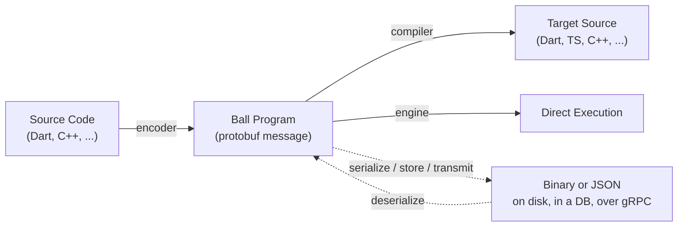

# Ball: The Programming Language Where Code *Is* Data

> This is the public "Introducing Ball" article — the one linked from the README and the
> website. Editorial history: originally reviewed in `docs/ARTICLE_REVIEW.md` (folded into
> issue [#136](https://github.com/Ball-Lang/ball/issues/136) during the docs audit), authored
> here in full with every requested revision applied. See "By the numbers" below for how to keep
> the figures in this article current.

Most programming languages start from the same place: a grammar, a parser, and a text file.
Ball starts somewhere else. **Every Ball program is a [Protocol Buffer](https://protobuf.dev/)
message** — the same structured, binary-serializable, cross-language format that powers gRPC
APIs at Google-scale. Compilers translate that message into idiomatic source in your target
language. Encoders go the other direction, turning existing source back into the same message.
Engines skip translation entirely and interpret the message directly.

If it deserializes, it's a syntactically valid program. There is no parser to satisfy, no
grammar ambiguity, and no "the file just doesn't build" — the protobuf schema itself is the
grammar.

## Hello World, for real

Here's what that looks like end to end. This is the actual `.ball.json` for the canonical
example in this repo (trimmed of `metadata`, which is cosmetic and never affects what the
program computes):

```json
{
  "@type": "type.googleapis.com/ball.v1.Program",
  "name": "hello_world",
  "modules": [
    {
      "name": "std",
      "functions": [{ "name": "print", "isBase": true }],
      "typeDefs": [{
        "name": "PrintInput",
        "descriptor": {
          "name": "PrintInput",
          "field": [{ "name": "message", "number": 1, "label": "LABEL_OPTIONAL", "type": "TYPE_STRING" }]
        }
      }]
    },
    {
      "name": "main",
      "functions": [{
        "name": "main",
        "outputType": "void",
        "body": {
          "call": {
            "module": "std", "function": "print",
            "input": { "messageCreation": { "typeName": "PrintInput", "fields": [
              { "name": "message", "value": { "literal": { "stringValue": "Hello, World!" } } }
            ]}}
          }
        }
      }]
    }
  ],
  "entryModule": "main",
  "entryFunction": "main"
}
```

The **same message**, run through three different compilers:

<table>
<tr><th>Dart</th><th>TypeScript</th></tr>
<tr><td>

```dart
void main() {
  print('Hello, World!');
}
```

</td><td>

```typescript
function main(): any {
  return console.log(__ball_to_string('Hello, World!'));
}
main();
```

</td></tr>
</table>

(`__ball_to_string` is a small runtime helper every compiled file carries, so `std`'s `print`
coerces its argument the same way regardless of static type — omitted from the Dart/C++ columns
above only because those languages' own `print`/`std::cout` already do that coercion natively.)

```cpp
// C++
int main() {
    std::cout << "Hello, World!" << std::endl;
    return 0;
}
```

And here's the Dart source that the **encoder** (not a human) turned back into that exact
`.ball.json` in the first place — round-tripping through the same protobuf message:

```dart
void main() {
  print('Hello, World!');
}
```

For anything more interesting than `Hello, World!`, the compiled and hand-written source
diverge more (the compiler is not aiming for cosmetically identical output — it's aiming for
behaviorally identical output), but the shape of the pipeline is exactly this for every program
Ball can represent, from a for-loop to a 300-line class hierarchy with generics and pattern
matching.

## Why does this matter?

**Parsing is not free, and it's not portable.** A hand-written recursive-descent parser (or a
grammar-generator like ANTLR) has to be re-derived for every language pair you want to support,
and every one of those parsers has its own bugs, its own edge cases, and its own maintenance
burden. Ball replaces that N-times-repeated grammar-parsing step with a single, well-tested
protobuf deserialization step — binary protobuf decoding is roughly 10-100x faster than lexing
and parsing source text, so this **nearly eliminates parsing overhead**, though it doesn't
eliminate all of it: deserializing the message still costs something, it's just a very cheap,
uniform, and battle-tested something, instead of N bespoke expensive somethings.

**Programs become data you can operate on.** Serialize a Ball program to binary, store it in a
database, diff two versions structurally instead of textually, send it over gRPC, or run static
analysis over its expression tree without writing a parser first. `ball audit` is a good example:
it walks the expression tree and reports every side-effecting base function call a program makes
— no `eval`, no FFI, no way to hide a capability, because there is no way to construct and
execute code that isn't already represented as a typed node in the tree.

**It's not "any code in any language."** To be precise about what Ball actually claims: the
encoders (today, Dart's `analyzer`-based encoder and C++'s Clang-AST-based encoder) use
syntactic heuristics, not full type resolution, so some constructs are genuinely ambiguous
without a type checker in the loop. And Ball's expression tree captures code *structure* —
control flow, calls, data shapes — not every runtime semantic of every host language (memory
models, ownership, threading primitives are represented as function calls into a target-specific
base module, not modeled natively). The honest claim is that **Ball can represent the core
constructs of most programming languages** — expressions, control flow, classes, closures,
generics, pattern matching, async/await — well enough that non-trivial real-world programs
round-trip correctly. The [conformance corpus](#by-the-numbers) is the proof, not a slogan.

## How mature is this, really?

"Ball implements 3 languages" undersells some and oversells others. The honest picture is a
maturity matrix, because *compiler*, *encoder*, and *engine* are three independently-built
pieces of a language, and a language isn't "done" until all three exist and pass the same
conformance corpus:

| Language | Compiler (Ball → lang) | Encoder (lang → Ball) | Engine (interpreter) |
|---|---|---|---|
| **Dart** | Full (reference implementation) | Full (`analyzer`-based) | Full — true async, tree-walking |
| **TypeScript** | Full (`ts-morph`-based) | Full (TS Compiler API, routes through universal `std`) | Full — **self-hosted**: compiled from the Dart engine's own Ball IR, runs in Node and the browser |
| **C++** | Full (string-emitting) | Full — consumes **Clang JSON AST** (`clang -Xclang -ast-dump=json`), not raw source | Full — **self-hosted**, passes every fixture in the conformance corpus |
| **Rust** | Full (string-emitting) | Full (`syn` AST-based) | Full — **self-hosted**, runs the whole corpus at Dart parity (319/319) |
| **C#** | Full (string-emitting) | Full — Roslyn syntax API, syntax-only | Full — **self-hosted**, runs the whole corpus at Dart parity (320/320) |
| Go, Python, Java | — | — | — |

Go, Python, and Java currently ship generated **protobuf bindings only** — you can read and
write `ball.v1.Program` messages in those languages, but there's no compiler, encoder, or
engine yet. This table drifts as the project moves; the authoritative,
always-current source is CI (`.github/workflows/ci.yml` and
`.github/workflows/conformance-matrix.yml`), not this paragraph.

Note, precisely, that C++ **encoding** doesn't mean "you compile C++ to Ball" in the sense of
running a C++ parser — the C++ encoder consumes the JSON AST Clang already produces
(`clang -Xclang -ast-dump=json`) and maps *that* structure onto Ball's expression tree. Clang
does the C++-specific parsing; Ball's encoder does the structural mapping.

## The strongest proof: Ball compiles itself

The single most convincing evidence that this approach works isn't a benchmark, it's this: **the
TypeScript and C++ engines are not hand-written.** The Dart reference engine — the
tree-walking interpreter that executes Ball programs — is itself encoded as a Ball program
(`dart/self_host/engine.ball.json`), then *compiled* to TypeScript and to C++ by Ball's own
compilers. The result is a TypeScript interpreter and a C++ interpreter, generated from the same
source of truth as the Dart one, that must pass the exact same conformance corpus as the
hand-written Dart engine — no separate tolerance, no asterisk. If a fixture passes on Dart, it is
required to pass on the self-hosted TS and C++ engines too, gated in CI on every change.

That's Ball eating its own dog food at the hardest level: not "can Ball represent a for-loop,"
but "can Ball represent an entire tree-walking interpreter, faithfully enough that the compiled
output of that interpreter, in a completely different language, produces byte-identical results
on hundreds of real programs."

## Why not WASM, LLVM IR, Haxe, Tree-sitter, or GraalVM?

This is the first question anyone who's shipped a compiler will ask, so let's address it head-on
instead of pretending the space is empty:

| Alternative | Where it falls short for this problem |
|---|---|
| **WebAssembly** | A low-level execution *target*, not a source-interchange format. Compiling to WASM throws away identifiers, control-flow shape, and type structure — you can't reconstruct readable, idiomatic Dart or TypeScript source from a `.wasm` binary. |
| **LLVM IR** | Same fundamental issue: designed for optimization and native codegen, not for round-tripping back into readable source in an arbitrary target language. |
| **Haxe** | A genuinely great multi-target compiler — but single-*input*-language. Ball is polyglot in both directions: many source languages in, many target languages out, via one shared structural representation. |
| **Tree-sitter** | An excellent incremental *parser* generator, but parse-only — no serialization format for the result, no cross-language execution model, no interpreter. |
| **GraalVM / Truffle** | A powerful polyglot *runtime*, but JVM-coupled — not something you drop into an iOS app or an embedded target without the JVM (or GraalVM's native-image toolchain) along for the ride. |

Ball's answer is narrower than any of these individually, but the combination — a structural,
language-agnostic, protobuf-native representation with compilers *and* encoders *and*
interpreters for the same schema — is the part none of the alternatives above do together.

## The design: one input, one output, seven node types

Every Ball function takes **exactly one input message and returns exactly one output message** —
the same convention gRPC uses for service methods. This isn't a limitation bolted on for
simplicity; it's what makes cross-language mapping tractable at all. A function with an
arbitrary parameter list has to be translated positionally, by name, with defaults, with
overloads — every target language does this differently. A function with one strongly-typed
input message doesn't: the input is just another protobuf message, mapped into that language's
native struct/record/class the same way any other message field is.

Underneath that constraint, **every possible Ball computation reduces to exactly one of seven
expression node types**:

| Node | Purpose | Example |
|---|---|---|
| `call` | Invoke a function | `std.add(left, right)` |
| `literal` | A constant value | `42`, `"hello"`, `true` |
| `reference` | Read a variable (the name `"input"` always means "this function's parameter") | `input`, `x` |
| `fieldAccess` | Read a field off a message | `input.name` |
| `messageCreation` | Construct a message | `Point{x: 1, y: 2}` |
| `block` | Run statements in sequence | `let x = 1; x + 1` |
| `lambda` | An anonymous function value | `(input) => input.x + 1` |

Control flow — `if`, `for`, `while`, `for_each` — is **not** a special case; each is a `call` to a
base function in the standard library, exactly like `add` or `print`. The one hard rule this
creates: compilers and engines **must** evaluate these lazily. `if` cannot eagerly evaluate both
branches before choosing one, or every Ball program with a base-case recursive function would
infinite-loop before it ever ran. Every base function in Ball has *no body* in the schema itself
— its behavior is supplied per-platform by the compiler or engine that implements it. That's the
entire extensibility model: want Ball to target Unity or Flutter? Define a new module of base
functions (`text`, `image`, `button`, whatever your platform needs) and implement them once per
compiler/engine backend.

## Binary vs. JSON, and why both exist

A `.ball.json` file (proto3 JSON encoding) is what you see in this article because it's
diffable and human-readable. But the same `Program` message also has a canonical **binary**
protobuf encoding, and that's the one that matters for anything performance- or size-sensitive:
smaller on the wire, faster to deserialize, and it's what integrity hashes are computed over (see
below). JSON is for humans and version control; binary is for the toolchain and the network. You
never have to choose — both are the same message, just serialized differently, and every Ball
tool round-trips between them without loss (metadata included).

## Modules, registries, and supply-chain integrity

A Ball `Module` isn't a single file — it's a self-describing unit with functions, first-class
type definitions, enums, type aliases, module-level constants, and even embedded asset files, all
in one schema (current, not simplified):

```proto
message Module {
  string name = 1;
  repeated google.protobuf.EnumDescriptorProto enums = 7;
  repeated FunctionDefinition functions = 3;
  string description = 5;
  google.protobuf.Struct metadata = 6;
  repeated ModuleImport module_imports = 4;
  repeated TypeDefinition type_defs = 8;
  repeated TypeAlias type_aliases = 11;
  repeated Constant module_constants = 12;
  repeated ModuleAsset assets = 13;
}
```

`ModuleImport` can resolve a dependency from an HTTP URL, a local file, inline bytes, a git repo,
or — the interesting one — a **language-native package registry** (`ball add
pub:some_package@^1.0.0` pulls from pub.dev, and the same mechanism targets npm and others). Every
import can carry a content-integrity hash in the form `"sha256:<hex>"`: the resolver serializes
the resolved module to canonical protobuf binary, hashes it, and refuses to proceed on a mismatch.
That's the same supply-chain protection lockfiles give you in other ecosystems, built into the
module-resolution schema itself rather than bolted on as a separate tool.

## Metadata is cosmetic — always

One invariant holds everywhere in Ball: **stripping all `metadata` from a program must never
change what it computes.** Variable names chosen by a human, source-formatting hints, "this was a
`class` vs. a `record`" annotations, cascade/spread syntactic sugar markers — all of it lives in a
`google.protobuf.Struct metadata` bag attached to the relevant node. The actual semantic content
of a program — its expression tree, function signatures, type descriptors, module structure — is
metadata-free. This is what makes the compilers "just" tree-walkers: they never have to guess
whether a piece of information is load-bearing or decorative, because the schema itself draws
that line.

It's also the property that makes Ball an unusually good fit for **AI-assisted code generation
and transformation.** A model reasoning about a Ball program is reasoning about pure structure —
no whitespace-sensitivity, no "did this bracket close," no ambiguity about what a token means
before it's actually parsed. Round-tripping through Ball's protobuf schema means a
language-generation or code-transformation task has a well-typed intermediate representation to
target instead of raw text, with the schema itself acting as a hard constraint on validity.

## Honest limitations

No language write-up is complete without saying where it doesn't shine yet:

- **Small ecosystem.** Ball is early. Three languages have a full pipeline; four have bindings
  only; one hasn't started. The standard library, while broad, is not exhaustive.
- **Imperfect feature mapping.** Some host-language features don't map cleanly onto the seven
  expression types without extra base-function surface area — highly dynamic metaprogramming,
  language-specific macro systems, and some advanced type-system features are harder to represent
  faithfully than straightforward imperative/OO/functional code.
- **Interpreted execution is slower than native.** The tree-walking engines (Dart, and the
  self-hosted TS/C++ engines compiled from it) are interpreters. For workloads that need
  compiled-native performance, *compiling* Ball to the target language and using that language's
  own compiler is the intended path — the engines are for portability and quick iteration, not
  peak throughput.
- **Dynamic-code restrictions on some platforms.** iOS's App Store policies restrict executing
  code that wasn't compiled ahead-of-time; running a Ball *engine* (as opposed to Ball-*compiled*
  native code) inside a shipped iOS app runs into the same restrictions any other
  interpreter/JIT does.
- **Syntactic, not semantic, encoding today.** As covered above, the current encoders work from
  syntax and Clang's AST, not a full type-checker — round-tripping is validated by the
  conformance corpus, but it is not a formal proof of equivalence for arbitrary source.

## By the numbers

<!--
  Figures verified against this repository at the time this article was written
  (2026-07). They will drift as the project grows — before republishing, regenerate
  them from these sources rather than trusting this callout:
    - Conformance fixture count:      `tests/conformance/*.ball.json` file count
    - Std base-function count:       `tests/conformance/STD_COVERAGE.md` "Summary" table
                                      (`cd dart/encoder && dart run bin/gen_std_coverage.dart`)
    - Proto-bindings language count: top-level `<lang>/shared/gen` directories
    - Upstream protobuf conformance: `dart/ball_protobuf/conformance/README.md`
-->

- **324 conformance fixtures** in `tests/conformance/`, each one a real, runnable program
  (classes, generics, async/await, pattern matching, closures, sorting algorithms, parsers —
  not toy snippets) executed and checked byte-identical across every engine that claims to
  support it.
- **257 standard-library base functions** across the 8 universal `std*` modules
  (arithmetic/control-flow/strings/collections/IO/memory/convert/filesystem/time/concurrency) —
  every target compiler and engine implements the same base-function surface.
- **Proto bindings generated for 8 languages** (Dart, TypeScript, C++, Rust, Go, Python, Java, C#)
  from the single `proto/ball/v1/ball.proto` schema via `buf generate` — before any compiler or
  encoder work starts, a language already has typed access to the `Program` message.
- **2,769 passing conformance checks, 0 failures**, against the *official upstream protobuf
  conformance suite* (`protocolbuffers/protobuf`) — `ball_protobuf`, Ball's own pure-Dart,
  Editions-aware protobuf runtime (which is itself Ball-portable and compiles to every target),
  round-trips proto2, proto3, and Editions test vectors including every well-known-type JSON
  mapping.

## Architecture, end to end



Every arrow in that diagram is the same message — `ball.v1.Program` — just moving through a
different tool. That's the whole idea: pick the direction you need (into Ball, out of Ball, or
straight to execution) and the underlying representation never changes.

## Try it

```bash
npm install @ball-lang/engine
```

```typescript
import { BallEngine } from '@ball-lang/engine';

const program = JSON.parse(fs.readFileSync('hello_world.ball.json', 'utf-8'));
const engine = new BallEngine();
await engine.run(program);
```

Or, from a checkout of this repository:

```bash
dart pub get
dart run ball_cli:ball run examples/hello_world/hello_world.ball.json
dart run ball_cli:ball compile examples/hello_world/hello_world.ball.json
dart run ball_cli:ball encode my_app.dart
```

The schema is [`proto/ball/v1/ball.proto`](../../proto/ball/v1/ball.proto). The code is at
[github.com/Ball-Lang/ball](https://github.com/Ball-Lang/ball).
